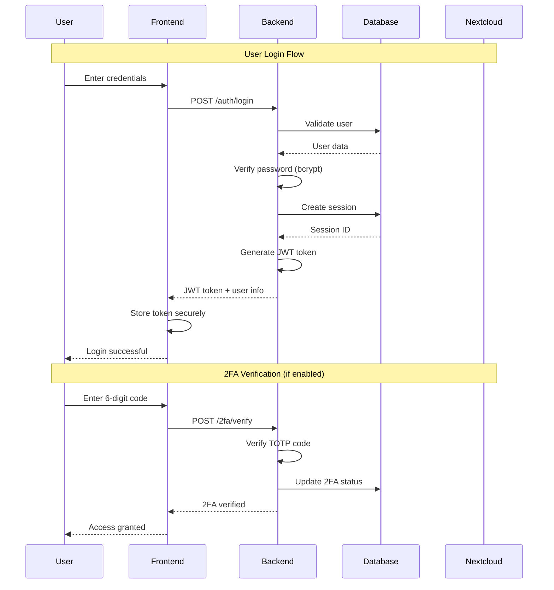
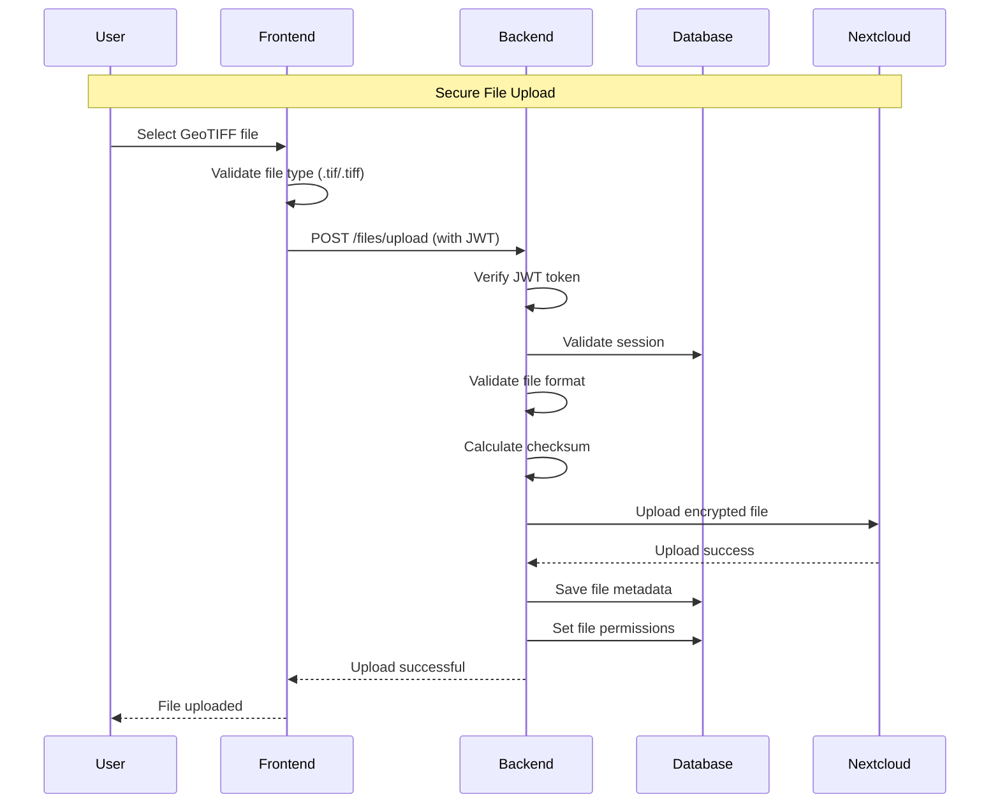
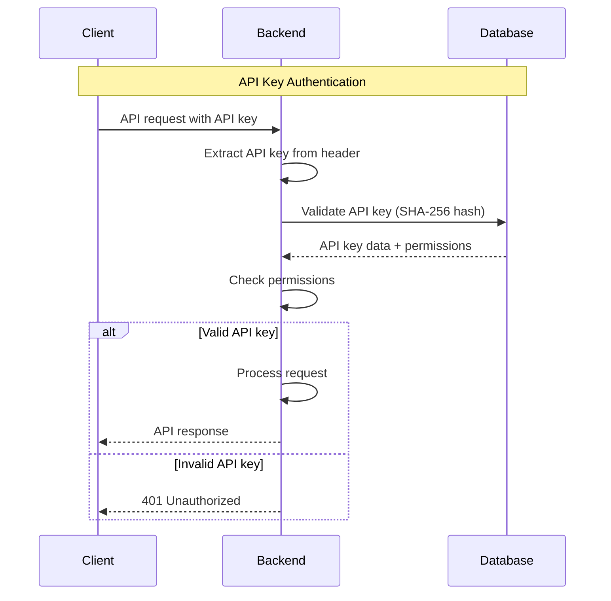
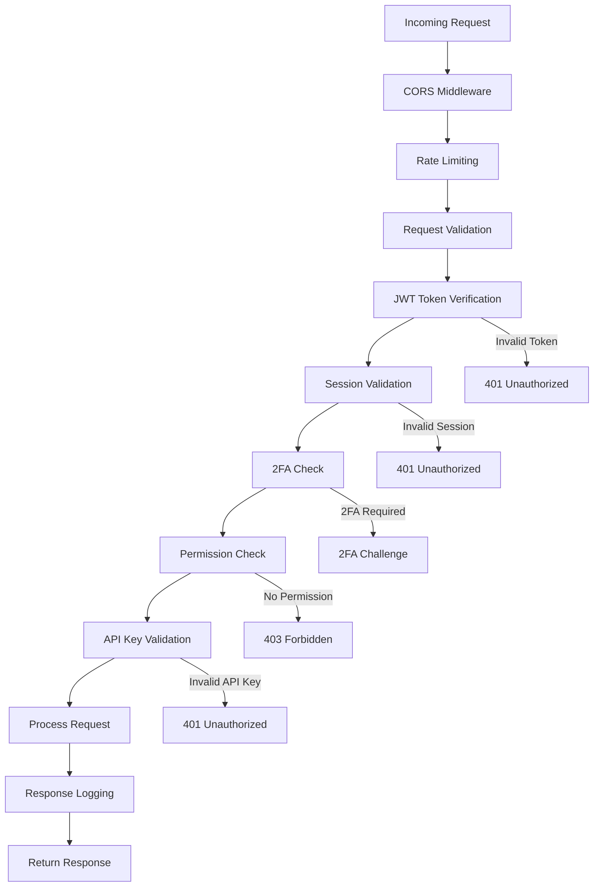
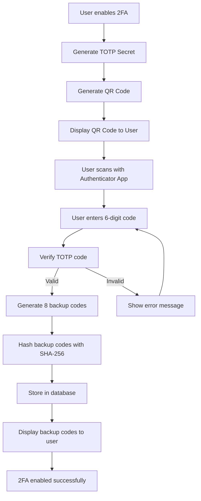
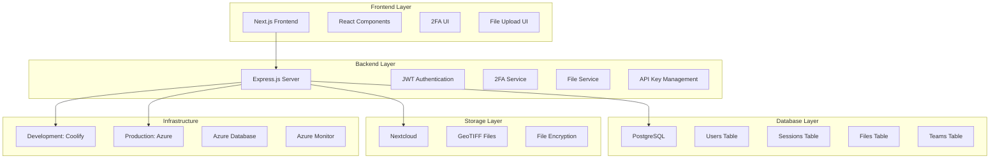
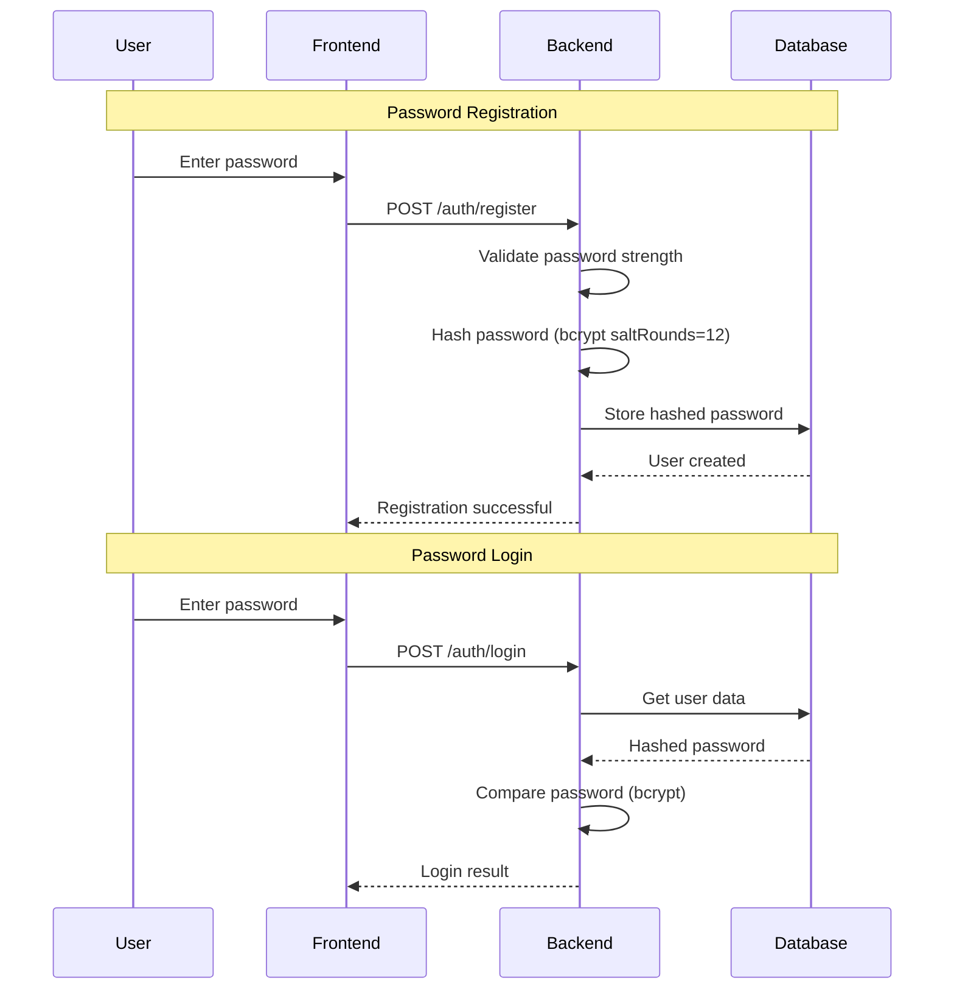
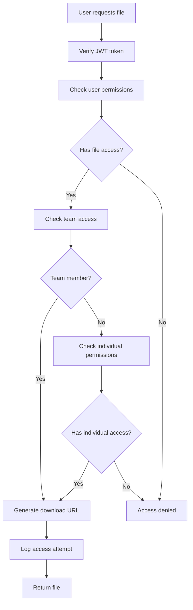
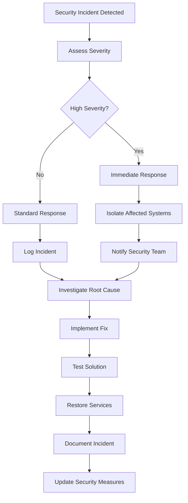
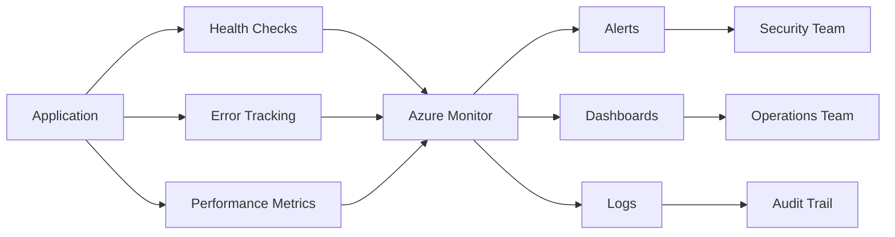

# Security Flow Diagrams

## ไดอะแกรม Flow ระบบรักษาความปลอดภัย TerraHost

---

## Authentication Flow Diagram

---

## File Upload Security Flow

---

## API Key Authentication Flow

---

## Security Middleware Stack

---

## 2FA Setup Flow

---

## System Architecture Overview

---

## Password Security Flow

---

## File Access Control Flow

---

## Security Incident Response

---

## Performance Monitoring

---

*เอกสารนี้ได้รับการอัปเดตล่าสุด: ${new Date().toLocaleDateString('th-TH')}*
*เวอร์ชัน: 1.0*
*สถานะ: ใช้งานจริง*
